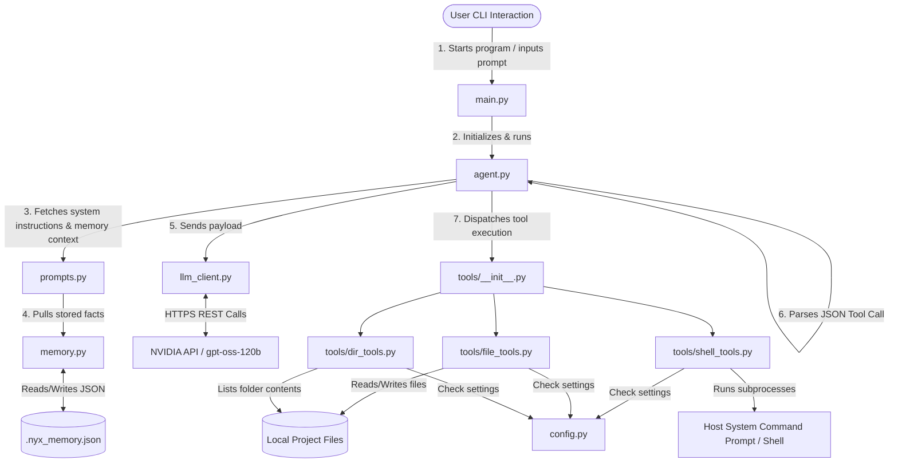

# NyX Agent — Technical Architecture & Function Reference

Welcome to the comprehensive technical documentation for the **NyX** agent. This document details the inner workings of NyX, explains how all the files are connected, describes the purpose and logic of every function in the codebase, and explains why understanding these details is essential for working with and extending autonomous agents.

---

## 🗺️ Architectural Overview & File Connections

NyX is built on a direct, light-weight **ReAct (Reasoning and Acting) loop** pattern. It does not use heavy agentic frameworks (like LangChain, AutoGen, or CrewAI), allowing you to see exactly how prompt engineering, JSON-based tool calls, and file/OS operations interact in plain Python.

The relationship and flow of control between the files is illustrated below:



### How the Files Connect
1. **Entry Point (`main.py`)**: Handles the command-line interface, user input, terminal formatting, and slash commands. It instantiates the `Agent` from `agent.py` and feeds the user inputs to it.
2. **The Brain (`agent.py`)**: Runs the central loop. It manages conversation history (combining the system prompt, user messages, tool calls, and tool results) and decides when to execute tools and when to reply to the user.
3. **The Connection Client (`llm_client.py`)**: Acts as a gateway to the NVIDIA API (which hosts the `openai/gpt-oss-120b` reasoning LLM). It wraps standard OpenAI API calls.
4. **The Instructions & Capabilities (`prompts.py`)**: Defines the system prompt, guidelines, rules, and the JSON format descriptions for all tools. It queries `memory.py` to inject past learnings into the prompt dynamically.
5. **The Memory Bank (`memory.py`)**: Saves facts persistently to `.nyx_memory.json` in the active workspace. This memory is read at the start of every message loop to provide session-to-session continuity.
6. **Configuration (`config.py`)**: Houses constants, model selections, allowed CLI commands (the shell allowlist), and directory recursion parameters.
7. **Tool Dispatched Registry (`tools/__init__.py`)**: Acts as a router. It imports functions from individual tool modules and maps them to a lookup table (`TOOL_MAP`) that the agent's parsed JSON calls trigger.
8. **The Tools (`tools/dir_tools.py`, `tools/file_tools.py`, `tools/shell_tools.py`)**: Implement low-level interactions with the host system, complete with safety sandboxing and input validation.

---

## 🔍 Codebase Deep Dive: Line-by-Line & Function Explanation

### 1. `config.py`
[config.py](file:///d:/1%20for%20all/bootcamp/nyx-agent/config.py) manages settings and credentials.

*   **API Configuration**:
    *   `API_BASE_URL`: Set to `"https://integrate.api.nvidia.com/v1"`.
    *   `API_KEY`: Fetches the variable `NVIDIA_API_KEY` from the environment.
    *   `MODEL_NAME`: Defined as `"openai/gpt-oss-120b"`.
*   **LLM Parameters**:
    *   `TEMPERATURE` (`0.6`): Balances creativity and determinism.
    *   `TOP_P` (`0.9`): Controls nucleus sampling.
    *   `MAX_TOKENS` (`4096`): Limits LLM response lengths.
*   **Agent Limits**:
    *   `MAX_TOOL_ROUNDS` (`10`): Restricts the agent to a maximum of 10 consecutive tool executions per user message to prevent infinite loops.
    *   `MEMORY_FILE` (`".nyx_memory.json"`): The name of the file where persistent facts are stored.
*   **Allowlists & Security Boundaries**:
    *   `ALLOWED_COMMANDS`: List of command prefixes permitted to run inside `shell_tools.py` (e.g., `python`, `pip`, `pytest`, `git`, `npm`, `npx`, `node`, `ls`, etc.).
    *   `MAX_DIR_DEPTH` (`3`): Prevents excessive recursion when listing folders.
    *   `MAX_FILES_SHOWN` (`100`): Caps output size when listing files to prevent overloading the LLM's context window.

---

### 2. `llm_client.py`
[llm_client.py](file:///d:/1%20for%20all/bootcamp/nyx-agent/llm_client.py) establishes the interface to the OpenAI-compatible NVIDIA API endpoint.

#### `create_client()`
*   **Purpose**: Instantiates and returns an `OpenAI` client.
*   **Logic**:
    1. Checks if `config.API_KEY` is set.
    2. If missing, raises a `ValueError` explaining how to configure the environment.
    3. Returns `OpenAI(base_url=config.API_BASE_URL, api_key=config.API_KEY)`.

#### `chat(client, messages)`
*   **Purpose**: Sends a chat message payload to the LLM and gets the response.
*   **Parameters**:
    *   `client`: An instance of `OpenAI`.
    *   `messages`: A list of dictionaries representing conversation history (`{"role": "...", "content": "..."}`).
*   **Logic**:
    1. Triggers `client.chat.completions.create` using settings from `config.py`.
    2. Retrieves the generated message object.
    3. Handles reasoning-specific LLM parameters: grabs the `reasoning_content` field (if the reasoning model supports it) using `getattr(message, "reasoning_content", None)`.
    4. Returns a dictionary: `{"content": content_string, "reasoning": reasoning_string_or_none}`.
    5. Catches any exception, converting it into a structured error dict to prevent crashes.

---

### 3. `prompts.py`
[prompts.py](file:///d:/1%20for%20all/bootcamp/nyx-agent/prompts.py) defines the agent's behavior rules and how tools are presented to the model.

*   `TOOL_DESCRIPTIONS`: A hardcoded string outlining all available tools (1 through 10) along with example JSON payloads representing how the model must invoke them.
*   `build_system_prompt()`:
    *   **Purpose**: Builds the system prompt template dynamically.
    *   **Logic**:
        1. Calls `memory.get_context_for_llm()` to pull stored facts.
        2. Interpolates `TOOL_DESCRIPTIONS` and the facts string into a structured prompt layout containing operational safety instructions (e.g., "always read before editing", "use exact find/replace matching").

---

### 4. `memory.py`
[memory.py](file:///d:/1%20for%20all/bootcamp/nyx-agent/memory.py) implements the memory storage backend.

#### `_memory_path()`
*   **Purpose**: Resolves the absolute path where the JSON memory file is located.
*   **Logic**: Searches upwards from the current working directory for project root indicators (like `.git`, `.env`, or the memory file). If found, it stores memory in that project root. Otherwise, it defaults to a global location in the user's home directory (`~/.nyx/`), ensuring memories are centralized rather than scattered.

#### `load()`
*   **Purpose**: Reads stored memories from the file.
*   **Logic**:
    1. Checks if the file exists at the resolved path. If not, returns `[]`.
    2. Opens the file in UTF-8 mode and parses it using `json.load()`.
    3. Performs validation to ensure it returns a list. If parsing fails, returns an empty list `[]`.

#### `save(entries)`
*   **Purpose**: Writes the updated memory list back to disk.
*   **Logic**: Opens the memory file and dumps the list of entries formatted with `indent=2`. Catches `IOError` warnings.

#### `add(text)`
*   **Purpose**: Saves a new fact to memory.
*   **Logic**: Loads current memories, strips text, and checks for case-insensitive duplicates. If a duplicate is found, updates its timestamp and saves. Otherwise, appends a new dict containing the text and the current timestamp formatted as `YYYY-MM-DD HH:MM:SS`, saves it to disk, and returns a confirmation string.

#### `clear()`
*   **Purpose**: Clears all saved memories.
*   **Logic**: Saves an empty list `[]` to the memory file.

#### `get_summary()`
*   **Purpose**: Generates a user-friendly numbered list of all stored memories for the `/memory` CLI command.
*   **Logic**: Iterates through saved memories and returns a formatted string containing entry indices, timestamps, and details.

#### `get_context_for_llm()`
*   **Purpose**: Supplies the memory context injected into the system prompt.
*   **Logic**: Retrieves the memory list. If empty, returns `"No stored memories."`. Otherwise, takes up to the last 20 memories, prefixes them with bullets (`-`), and joins them into a single string.

---

### 5. `agent.py`
[agent.py](file:///d:/1%20for%20all/bootcamp/nyx-agent/agent.py) is the core controller class. It controls the ReAct flow.

#### `Agent.__init__(self)`
*   **Purpose**: Creates the client connection and establishes initial state.
*   **Logic**: Initializes the OpenAI client and builds the initial conversation message list with the system prompt.

#### `Agent._reset_system_prompt(self)`
*   **Purpose**: Refreshes the system prompt with the latest memory contents.
*   **Logic**: Calls `prompts.build_system_prompt()`. If the messages history already has a system message at index 0, overwrites its content; otherwise, inserts it at index 0.

#### `Agent.run(self, user_message)`
*   **Purpose**: Coordinates the turn-by-turn interactive process.
*   **Logic**:
    1. Appends the user's message to the conversation history.
    2. Initiates a loop constrained by `config.MAX_TOOL_ROUNDS`:
        *   Re-syncs the system prompt to fetch any newly created memories dynamically at the start of each round.
        *   Sends current conversation history to `llm_client.chat`.
        *   Prints `[thinking...]` if the model exposes reasoning logs.
        *   Tries to extract a JSON tool call from the response via `self._parse_tool_call()`.
        *   **If a tool call is detected**:
            *   Logs the tool name and arguments (truncating long values for terminal formatting).
            *   If the tool is a modifying or command tool (`create_file`, `overwrite_file`, `append_file`, `edit_file`, `create_directory`, `run_command`), it prompts the user in the CLI for review/approval. Execution only proceeds if the user approves. If the user declines, execution is cancelled and a cancellation message is returned as the tool result.
            *   Executes the tool via `execute_tool()` from `tools/__init__.py`.
            *   Appends the tool result as a message with a custom format: `[TOOL RESULT for ...] ... [/TOOL RESULT]`.
            *   Repeats the loop (the model now receives the tool result and decides what to do next).
    3. If the loop completes 10 rounds without yielding a text response, returns a fallback explanation message.

#### `Agent._parse_tool_call(self, text)`
*   **Purpose**: Extracts structured JSON tool commands from the LLM's response.
*   **Logic**:
    *   **Strategy 1 (Exact match)**: Tries to parse the raw text directly as JSON.
    *   **Strategy 2 (Fenced Code Block)**: Searches for markdown formatting such as ` ```json { ... } ``` ` or ` ``` { ... } ``` ` using a regular expression.
    *   **Strategy 3 (Surrounding Text)**: Searches for the first occurrence of `{` and last occurrence of `}` in the text.
    *   If any of these strategies successfully parse into a JSON object containing a `"tool"` key, returns it. Otherwise, returns `None`.

#### `Agent._try_parse_json(self, text)`
*   **Purpose**: Helper function to execute safe JSON loads.
*   **Logic**: Wraps `json.loads` in a try-except block. Returns a dictionary on success, or `None` on failure.

#### `Agent._trim_history(self)`
*   **Purpose**: Prevents the context history from exceeding the model's limits.
*   **Logic**: Caps the conversation size to 42 messages. If exceeded, preserves the system prompt at index 0 and joins it with the most recent 41 messages.

---

### 6. `main.py`
[main.py](file:///d:/1%20for%20all/bootcamp/nyx-agent/main.py) manages startup settings, terminals, color utilities, and user interactions.

*   **Terminal Reconfiguration**: Lines 19-24 execute a quick console check. On Windows, it calls `os.system("")` (which enables ANSI sequence parsing in cmd/PowerShell) and reconfigures `sys.stdout` to force `utf-8` encoding.
*   `print_banner()`: Prints a stylized ASCII art banner.
*   `print_help()`: Prints detailed usage summaries of slash commands and agent capabilities.
*   `handle_slash_command(command, agent)`:
    *   **Purpose**: Intercepts commands starting with `/`.
    *   **Logic**:
        *   `/help`: Prints the help text.
        *   `/exit` / `/quit`: Prints goodbye and calls `sys.exit(0)`.
        *   `/memory`: Fetches and prints the memory summary.
        *   `/forget`: Deletes memories using `memory.clear()`.
        *   `/clear`: Resets conversation logs by re-instantiating the agent (`agent.__init__()`).
        *   `/files`: Calls `list_directory('.')` to list files in the current folder.
        *   Returns `True` if a command was handled, `False` otherwise.
*   `main()`:
    *   **Purpose**: The main interactive CLI loop.
    *   **Logic**:
        1. Checks for the presence of `NVIDIA_API_KEY`; exits if missing.
        2. Prints startup banners and initializes the `Agent`.
        3. Prompts the user with `You ▸ ` using ANSI colors.
        4. If the input starts with `/`, routes it through `handle_slash_command()`.
        5. Feeds regular messages to `agent.run()` and prints the agent's response.
        6. Safely catches keyboard interrupts (`Ctrl+C`), `EOFError`, and execution errors.

---

### 7. `tools/__init__.py`
[tools/\_\_init\_\_.py](file:///d:/1%20for%20all/bootcamp/nyx-agent/tools/__init__.py) houses the tool mapper.

*   `TOOL_MAP`: A dictionary matching string command names with their concrete Python functions:
    *   `"read_file"` ➔ `read_file`
    *   `"create_file"` ➔ `create_file`
    *   `"overwrite_file"` ➔ `overwrite_file`
    *   `"append_file"` ➔ `append_file`
    *   `"edit_file"` ➔ `edit_file`
    *   `"list_directory"` ➔ `list_directory`
    *   `"create_directory"` ➔ `create_directory`
    *   "run_command" ➔ run_command
    *   `"save_memory"` ➔ `_save_memory_wrapper` (robust parameter checking)
    *   `"read_memory"` ➔ `_read_memory_wrapper` (robust parameter checking)
*   `execute_tool(tool_name, params)`:
    *   **Purpose**: Resolves and executes a tool safely.
    *   **Logic**:
        1. Checks if the tool exists in `TOOL_MAP`.
        2. Unpacks `params` (if provided as a dictionary) as keyword arguments `handler(**params)`.
        3. If no params are provided, calls `handler()`.
        4. Catches exceptions and returns them as strings back to the agent so it can self-correct.

---

### 8. `tools/file_tools.py`
[tools/file\_tools.py](file:///d:/1%20for%20all/bootcamp/nyx-agent/tools/file_tools.py) handles operations on files.

#### `_safe_path(path)`
*   **Purpose**: Verifies that path coordinates remain within the workspace directory.
*   **Logic**: Resolves the target path to an absolute path via `os.path.normpath(os.path.join(os.getcwd(), path))`. Checks if the resolved path starts with the workspace folder's path (`os.getcwd()`). If it escapes (e.g. `../../windows/`), raises a `ValueError` to block the operation.

#### `read_file(path)`
*   **Purpose**: Reads files and displays contents to the LLM.
*   **Logic**: Resolves the safe path, checks file availability, and splits the content into lines. Prefixes each line with line numbers (e.g. `   1 | print("hello")`) to make editing and debugging easier for the LLM.

#### `create_file(path, content)`
*   **Purpose**: Creates new files.
*   **Logic**: Validates paths. Blocks creation if the file already exists. Automatically creates missing parent directories using `os.makedirs`. Writes content as UTF-8.

#### `overwrite_file(path, content)`
*   **Purpose**: Overwrites existing files or creates new ones.
*   **Logic**: Creates parent directories if needed, and writes content as UTF-8, replacing whatever was previously in the file.

#### `append_file(path, content)`
*   **Purpose**: Appends content to the end of a file.
*   **Logic**: Validates file presence, opens the file in append (`"a"`) mode, and writes the contents.

#### `edit_file(path, find_text, replace_text)`
*   **Purpose**: Modifies code inside files using search and replace.
*   **Logic**:
    1. Reads the target file's content.
    2. Checks if `find_text` exists in the file. If not, returns an error message containing the searched text.
    3. Replaces `find_text` with `replace_text` using Python's `str.replace()`.
    4. Writes the updated content back to disk.

---

### 9. `tools/dir_tools.py`
[tools/dir\_tools.py](file:///d:/1%20for%20all/bootcamp/nyx-agent/tools/dir_tools.py) lists files and directories.

#### `list_directory(path=".", max_depth=None)`
*   **Purpose**: Returns a structured file list.
*   **Logic**:
    1. Normalizes the path and checks that it is within the workspace.
    2. Filters out noise directories (such as `.git`, `__pycache__`, `node_modules`, `venv`).
    3. Recursively lists directory contents up to `config.MAX_DIR_DEPTH`.
    4. Formats file listings with sizes and displays folders with a trailing slash (`/`).
    5. Formats file nodes as `[F]` and folder nodes as `[D]`.

#### `_format_size(size_bytes)`
*   **Purpose**: Converts bytes into human-readable strings (e.g., `B`, `KB`, `MB`).

#### `create_directory(path)`
*   **Purpose**: Creates a new directory path safely within the workspace boundary (utilizes `_safe_path` check).

---

### 10. `tools/shell_tools.py`
[tools/shell\_tools.py](file:///d:/1%20for%20all/bootcamp/nyx-agent/tools/shell_tools.py) runs system terminal processes.

#### `run_command(command)`
*   **Purpose**: Executes shell commands within a sandbox boundary.
*   **Logic**:
    1. Checks if the command is allowed via `_is_allowed()`.
    2. Runs the command using `subprocess.run` with a timeout of 30 seconds to prevent hanging processes.
    3. Captures stdout and stderr, combines them, and returns them to the agent.
    4. If the return code is non-zero, appends the exit code info to the return string.

#### `_is_allowed(command)`
*   **Purpose**: Checks if a command matches the allowlist in `config.py`.
*   **Logic**: Checks if the lowercase command matches or starts with one of the entries in `ALLOWED_COMMANDS` followed by a space.

---

### 11. Launcher Scripts
*   **`nyx.cmd`**: Launch script for Windows Command Prompt. It calls `python "%~dp0main.py" %*`.
*   **`nyx.ps1`**: Launch script for PowerShell. It calls `python "$PSScriptRoot\main.py" $args`.

---

## 💡 Why You Must Know Every Single Detail of This Project

Understanding the exact details of the NyX codebase is important for several reasons:

1.  **Safety & Security Verification**: Since this agent can run terminal commands (`shell_tools.py`) and modify filesystem structures (`file_tools.py`), you must understand its safety limits. Knowing how `_safe_path` prevents directory traversal attacks (`../../`) and how the shell allowlist restricts command execution ensures you can run it safely.
2.  **Extending & Customizing the Agent**: If you want to add new capabilities—like a tool to fetch web pages, read database schemas, or interact with git—you need to know exactly how to register functions in `tools/__init__.py` and list them in the system prompt in `prompts.py`.
3.  **Understanding ReAct Loops**: Modern AI frameworks hide the interaction loop behind layers of code. Understanding `agent.py` gives you a clear picture of how autonomous agents function: prompting, receiving structured JSON, executing actions, appending results, and sending the context back to the LLM to get a final answer.
4.  **Debugging & Optimization**: When the agent fails to edit a file because of a whitespace mismatch or fails to parse a tool call, knowing how JSON extraction, regex parsing, and tool execution handles errors allows you to debug and fix issues quickly.
